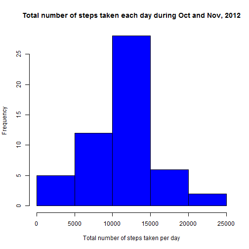
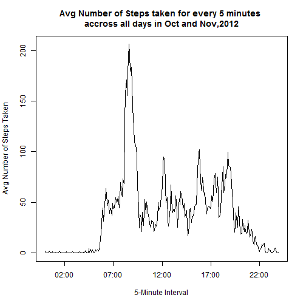
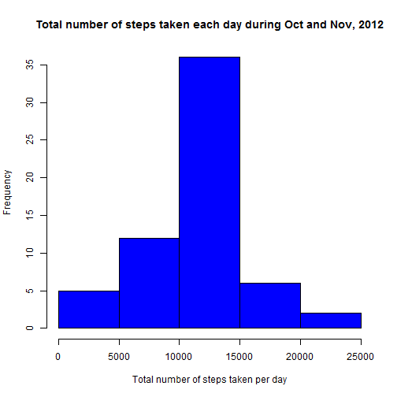

## Introduction
It is now possible to collect a large amount of data about personal movement using activity monitoring devices such as a Fitbit, Nike Fuelband, or Jawbone Up. These type of devices are part of the "quantified self" movement - a group of enthusiasts who take measurements about themselves regularly to improve their health, to find patterns in their behavior, or because they are tech geeks. But these data remain under-utilized both because the raw data are hard to obtain and there is a lack of statistical methods and software for processing and interpreting the data.

Below are the results of the Peer Assessment 1 assignment from the Reproducible Research Course in Coursera. This assignment makes use of data from a personal activity monitoring device. This device collects data at 5 minute intervals through out the day. The data consists of two months of data from an anonymous individual collected during the months of October and November, 2012 and include the number of steps taken in 5 minute intervals each day.

## Data
The data for this assignment can be downloaded from the course web site

- Dataset: [Activity monitoring data](https://d396qusza40orc.cloudfront.net/repdata%2Fdata%2Factivity.zip) [52K]

The variables included in this dataset are:

- steps: Number of steps taking in a 5-minute interval (missing values are coded as NA)
- date: The date on which the measurement was taken in YYYY-MM-DD format
- interval: Identifier for the 5-minute interval in which measurement was taken

The dataset is stored in a comma-separated-value (CSV) file and there are a total of 17,568 observations in this dataset.

## Assignment

### Loading and preprocessing the data

- Read the downloaded File is placed in the directoy: data/repdata-data-activity/activity.csv
- Removing the records have Steps = NA and storign as a subset.


```r
library(data.table)
DT <- fread("data/repdata-data-activity/activity.csv", na.strings="NA")
sub_DT <- DT[!is.na(DT$steps)]
```

Notice that a consider amount of rows have been ignored for the following calculations

### What is mean total number of steps taken per day?

1. Calculation of the total steps taken per day.


```r
sub_DT1 <- sub_DT[,sum(steps),by=date]
```

2. A Histogram representing the total steps taken each day during the months of October and November, 2012.


```r
hist(sub_DT1$V1,col = 'blue', xlab = 'Total number of steps taken per day', main = "Total number of steps taken each day during Oct and Nov, 2012")
```

 

3. Mean and Median of total steps taken each day.


```r
mean(sub_DT1$V1)
```

```
## [1] 10766.19
```

```r
median(sub_DT1$V1)
```

```
## [1] 10765
```


### What is the average daily activity pattern?

1. Time series plot of the 5-minute interval (x-axis) and the average number of steps taken, averaged across all days (y-axis)


```r
library(lubridate)
sub_DT2 <- sub_DT[,mean(steps),by=interval]
sub_DT2[,time_int1:= ymd("1960-01-01") + hm(paste(floor(interval/100),interval%%100,sep = ":"))]
```

**Converted the numeric time intervals to Time format using lubridate package and appending a dummy date, such that the plot of intervals appear without breaks.**


```r
plot(sub_DT2$time_int1,sub_DT2$V1,type = 'l',xlab ="5-Minute Interval", ylab ="Avg Number of Steps Taken", main = ("Avg Number of Steps taken for every 5 minutes \naccross all days in Oct and Nov,2012") )
```

 

2. The 5-minute interval, on average across all the days in the dataset, contains the maximum number of steps is 835

### Imputing missing values

1. Total number of missing values in the dataset is calcualted below.


```r
dim(DT)[1] - dim(sub_DT)[1]
```

```
## [1] 2304
```

2. Filling the Missing Values with the mean value of the 5-minute interval accross all days


```r
DT1 <- copy(DT)
for( i in which(is.na(DT$steps))){
    DT1[i]$steps <- as.integer(floor(sub_DT2[interval == DT1[i]$interval]$V1))
}
```


3. A Histogram representing the total steps taken each day during the months of October and November, 2012.


```r
for_hist <- DT1[,sum(steps),by=date]
hist(for_hist$V1,col = 'blue', xlab = 'Total number of steps taken per day', main = "Total number of steps taken each day during Oct and Nov, 2012")
```

 

4. Mean and Median of total steps taken each day.


```r
mean(for_hist$V1)
```

```
## [1] 10749.77
```

```r
median(for_hist$V1)
```

```
## [1] 10641
```

**Note: There is a small variation in the mean and median of the total steps taken for each day after filling the missing values.**

## Are there differences in activity patterns between weekdays and weekends?

1. Create a new factor variable in the dataset with two levels - "weekday" and "weekend"


```r
check_weekday <- function(day = 'Mon'){
                  wdays <- c("Mon","Tue","Wed","Thu","Fri")
                  if( day  %in% wdays){
                    "Weekday"
                  }
                  else {
                    "Weekend"
                  }
                  }
DT1[,day := weekdays(ymd(date),abbreviate='TRUE')]
```

```
##        steps       date interval day
##     1:     1 2012-10-01        0 Mon
##     2:     0 2012-10-01        5 Mon
##     3:     0 2012-10-01       10 Mon
##     4:     0 2012-10-01       15 Mon
##     5:     0 2012-10-01       20 Mon
##    ---                              
## 17564:     4 2012-11-30     2335 Fri
## 17565:     3 2012-11-30     2340 Fri
## 17566:     0 2012-11-30     2345 Fri
## 17567:     0 2012-11-30     2350 Fri
## 17568:     1 2012-11-30     2355 Fri
```

```r
DT1[,ind := lapply(day,check_weekday)]
```

```
##        steps       date interval day     ind
##     1:     1 2012-10-01        0 Mon Weekday
##     2:     0 2012-10-01        5 Mon Weekday
##     3:     0 2012-10-01       10 Mon Weekday
##     4:     0 2012-10-01       15 Mon Weekday
##     5:     0 2012-10-01       20 Mon Weekday
##    ---                                      
## 17564:     4 2012-11-30     2335 Fri Weekday
## 17565:     3 2012-11-30     2340 Fri Weekday
## 17566:     0 2012-11-30     2345 Fri Weekday
## 17567:     0 2012-11-30     2350 Fri Weekday
## 17568:     1 2012-11-30     2355 Fri Weekday
```

```r
pp <- DT1[,mean(steps),by=interval]
```

2. Creation of panel plot containing a time series plot (i.e. type = "l") of the 5-minute interval (x-axis) and the average number of steps taken, averaged across all weekday days or weekend days (y-axis).


